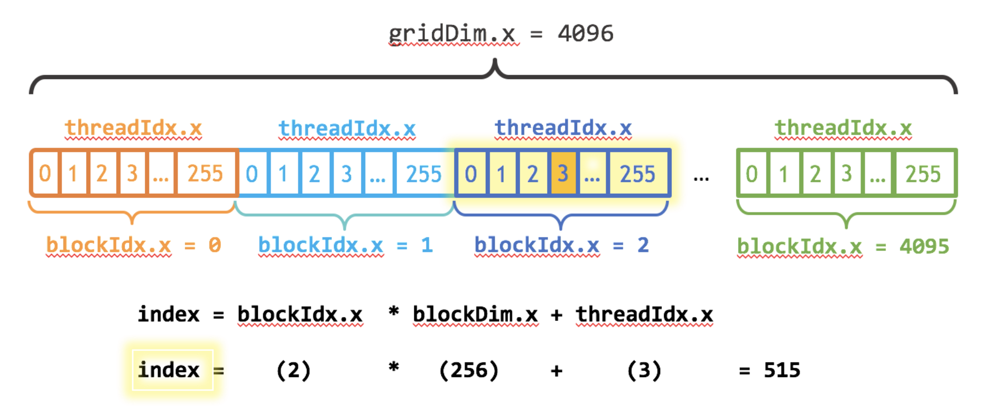

# Tutorial Reference
```
https://cuda-tutorial.readthedocs.io/en/latest
https://developer.nvidia.com/blog/even-easier-introduction-cuda/
https://developer.nvidia.com/blog/cuda-pro-tip-write-flexible-kernels-grid-stride-loops/
```

# Compile
c compile: `gcc <input.c> -o <output>`  
cuda compile: `nvcc <input.cu> -o <output>` 

# Common workflow of cuda program
1. Allocate host memory and initialized host data
2. Allocate device memory
3. Transfer input data from host to device memory
4. Execute kernels
5. Transfer output from device memory to host
Note: You can't ask cuda code to write result directly to host memory

# Cuda action
```
<<< M , T >>>
M = thread blocks per grid
T = parallel thread per block
```


# Profiling
1. `time <executable>`
```
yisheng@pc:~/playground/cuda/demo$ time bin/vecadd_cu
Vector addition completed successfully

real    1m5.709s
user    1m2.626s
sys     0m3.047s
```
2. `sudo nsys nvprof <executable>`
prerequisite: install nvidia nsight systems  
ref: https://developer.nvidia.com/nsight-systems  
```
yisheng@pc:~/playground/cuda/demo$ sudo nsys nvprof bin/vecadd_cu
WARNING: vecadd_cu and any of its children processes will be profiled.

Collecting data...
Vector addition completed successfully
Generating '/tmp/nsys-report-dba1.qdstrm'
[1/7] [========================100%] report1.nsys-rep
[2/7] [========================100%] report1.sqlite
[3/7] Executing 'nvtx_sum' stats report
SKIPPED: /home/yisheng/playground/cuda/demo/report1.sqlite does not contain NV Tools Extension (NVTX) data.
[4/7] Executing 'cuda_api_sum' stats report

 Time (%)  Total Time (ns)  Num Calls      Avg (ns)        Med (ns)      Min (ns)       Max (ns)       StdDev (ns)              Name         
 --------  ---------------  ---------  ----------------  -------------  -----------  --------------  ----------------  ----------------------
     99.9   61,104,470,031          3  20,368,156,677.0  517,879,295.0  517,699,187  60,068,891,549  34,381,844,948.2  cudaMemcpy            
      0.1       58,553,935          3      19,517,978.3      108,350.0      107,587      58,337,998      33,619,123.2  cudaMalloc            
      0.0        5,956,526          3       1,985,508.7    2,110,308.0    1,113,192       2,733,026         817,096.5  cudaFree              
      0.0          182,844          1         182,844.0      182,844.0      182,844         182,844               0.0  cudaLaunchKernel      
      0.0              893          1             893.0          893.0          893             893               0.0  cuModuleGetLoadingMode

[5/7] Executing 'cuda_gpu_kern_sum' stats report

 Time (%)  Total Time (ns)  Instances      Avg (ns)          Med (ns)         Min (ns)        Max (ns)     StdDev (ns)                     Name                    
 --------  ---------------  ---------  ----------------  ----------------  --------------  --------------  -----------  -------------------------------------------
    100.0   58,750,178,103          1  58,750,178,103.0  58,750,178,103.0  58,750,178,103  58,750,178,103          0.0  vector_add(float *, float *, float *, long)

[6/7] Executing 'cuda_gpu_mem_time_sum' stats report

 Time (%)  Total Time (ns)  Count     Avg (ns)         Med (ns)        Min (ns)       Max (ns)     StdDev (ns)           Operation          
 --------  ---------------  -----  ---------------  ---------------  -------------  -------------  -----------  ----------------------------
     56.0    1,318,189,266      1  1,318,189,266.0  1,318,189,266.0  1,318,189,266  1,318,189,266          0.0  [CUDA memcpy Device-to-Host]
     44.0    1,035,506,596      2    517,753,298.0    517,753,298.0    517,697,903    517,808,693     78,340.4  [CUDA memcpy Host-to-Device]

[7/7] Executing 'cuda_gpu_mem_size_sum' stats report

 Total (MB)  Count  Avg (MB)   Med (MB)   Min (MB)   Max (MB)   StdDev (MB)           Operation          
 ----------  -----  ---------  ---------  ---------  ---------  -----------  ----------------------------
  8,000.000      2  4,000.000  4,000.000  4,000.000  4,000.000        0.000  [CUDA memcpy Host-to-Device]
  4,000.000      1  4,000.000  4,000.000  4,000.000  4,000.000        0.000  [CUDA memcpy Device-to-Host]

Generated:
    /home/yisheng/playground/cuda/demo/report1.nsys-rep
    /home/yisheng/playground/cuda/demo/report1.sqlite
```

# Play with cuda actions
```
sudo nsys nvprof bin/vecadd_1_1_cu

 Time (%)  Total Time (ns)  Instances    Avg (ns)      Med (ns)     Min (ns)    Max (ns)   StdDev (ns)                     Name                   
 --------  ---------------  ---------  ------------  ------------  ----------  ----------  -----------  ------------------------------------------
    100.0       62,506,521          1  62,506,521.0  62,506,521.0  62,506,521  62,506,521          0.0  vector_add(float *, float *, float *, int)

sudo nsys nvprof bin/vecadd_1_256_cu

 Time (%)  Total Time (ns)  Instances   Avg (ns)     Med (ns)    Min (ns)   Max (ns)   StdDev (ns)                     Name                   
 --------  ---------------  ---------  -----------  -----------  ---------  ---------  -----------  ------------------------------------------
    100.0        1,250,775          1  1,250,775.0  1,250,775.0  1,250,775  1,250,775          0.0  vector_add(float *, float *, float *, int)

sudo nsys nvprof bin/vecadd_4096_256_cu
 Time (%)  Total Time (ns)  Instances  Avg (ns)  Med (ns)  Min (ns)  Max (ns)  StdDev (ns)                     Name                   
 --------  ---------------  ---------  --------  --------  --------  --------  -----------  ------------------------------------------
    100.0           39,905          1  39,905.0  39,905.0    39,905    39,905          0.0  vector_add(float *, float *, float *, int)
```