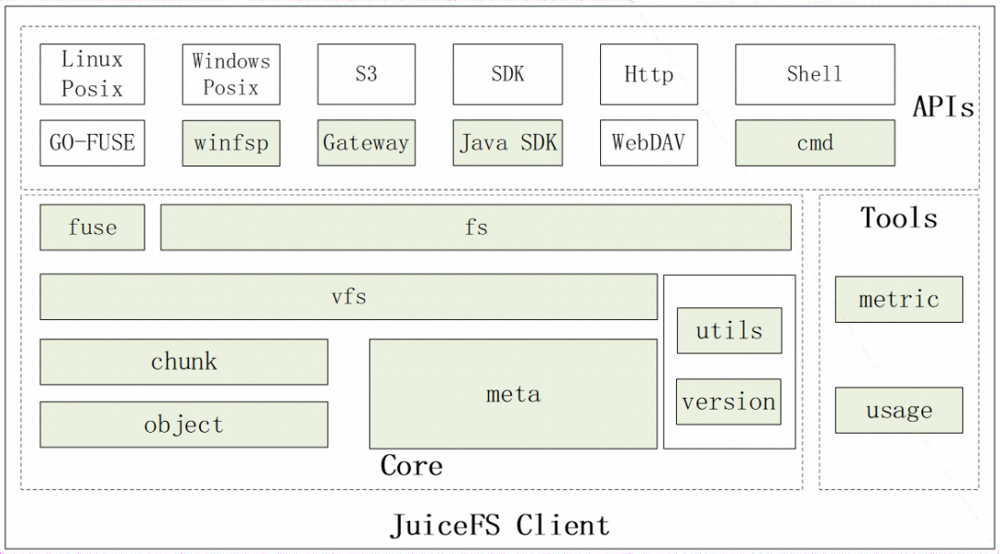

# JuiceFS
a distributed file system
## Architecture
- client: support POSIX, HDFS, K8S, S3 API, WebDAV
- object storage: support public cloud service object storage and private object storage like minio
- metadata storage: file metadata + data index, support redis, mysql, postgresql, sqlite, etc.  
## Framework
- APIs: posix, gateway, sdk
- Core: object, chunk, meta, fuse, fs, vfs
- Tools: metric, usage

