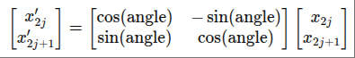

# Positional Encoding

## Overview
Adds position information to token embeddings, enabling transformers to understand sequence order.

It's added to Q and K so that attention score can be calculated with position information

We focus on RoPE here

## Formulation

θj​ = `10000^(−2j/d)`  

j: index of a coordinate pair  
d: hidden dimension size of embedding  

for each position m:  
angle = m*θj  

given a vector slice (x2j, x2j+1), rotate it by angle.  

without RoPE:   
PE(m, 2j) = `sin(m*θj)`   
PE(m, 2j+1) = `cos(m*θj)`   

with RoPE: (rotate vector by an angle)   

## Property
- long-term decay  
    inner product decays when relative position increases  
- relative distance  
    RoPE focus on relative distance (favored over absolute PE)  
