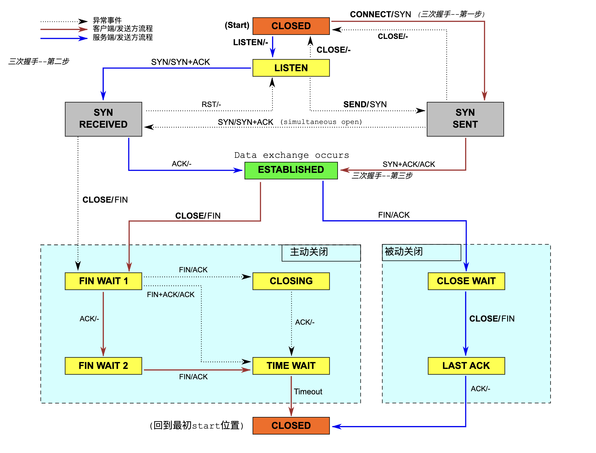
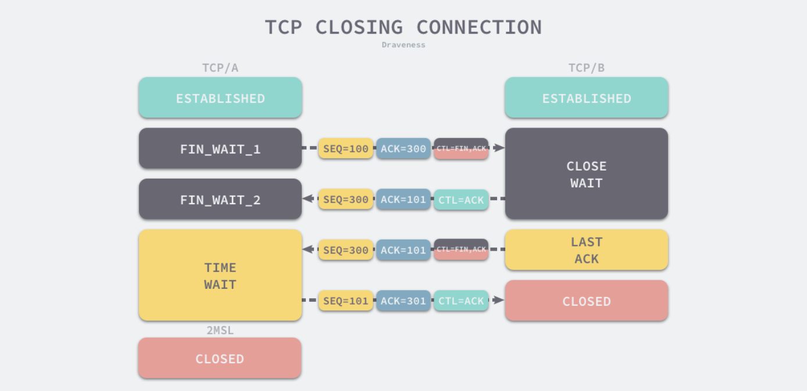

# State
LISTEN - represents waiting for a connection request from any remote TCP and port.  
SYN-SENT - represents waiting for a matching connection request after having sent a connection request.  
SYN-RECEIVED - represents waiting for a confirming connection request acknowledgment after having both received and sent a connection request.  
ESTABLISHED - represents an open connection, ready to transmit and receive data segments.  
FIN-WAIT-1 - represents waiting for a connection termination request from the remote TCP, or an acknowledgment of the connection termination request previously sent.  
FIN-WAIT-2 - represents waiting for a connection termination request from the remote TCP.  
TIME-WAIT - represents waiting for enough time to pass to be sure the remote TCP received the acknowledgment of its connection termination request.  
CLOSE-WAIT - represents waiting for a connection termination request from the local user.  
CLOSING - represents waiting for a connection termination request acknowledgment from the remote TCP.  
CLOSED - represents no connection state at all.  



## Steps to establish
SYN, ACK, SYN  

```
Q1: Why need 3 way handshake?
A1: If only 1 way handshake, the client do not know whether its message to server is received.
    If only 2 way handshake, the server do not know whether its message to server is received.
    3 way handshake is the minimum requirement for both client and server know that the connection can be established.
    But in theory there're problems like, the client does not know the third SYN to server can be received, it's an engineering design. 
```

## Steps to close
FIN, ACK, FIN, ACK  

State
proactively closed: FIN_WAIT_1, FIN_WAIT_2, TIME_WAIT  
passively closed: CLOSE_WAIT, LAST_ACK  

Note: the proactively closed client need to wait 2 MSL before close the connection. It's 2min by default on linux.  



```
Q1: Why TIME_WAIT takes 2 MSL to close?
A1: To make sure that the connection can be gracefully closed. 
    1. There could still be delayed packets in the network that may arrive after the connection has been terminated after a connection is closed. If the connection is opened again, stale packets may cause confusions.
    2. Make sure the last ack sent to server can be received. Otherwise it may cause new connection fail to establish.
    Why 2 MSL? Because in the worst cause both the packet sent from client is delayed and the ack packet sent from server is delayed. So it's 2 MSL.
    This limits the number that we can establish connections with one target ip (server). We can only establish about 28,232 connections in one minute to target ip. 

Q2: Why 4 way close?
A2: 

Q3: Explain tcp_tw_reuse
A3:

Q4: Explain tcp_tw_recycle and why it's removed from linux.
A4:
```