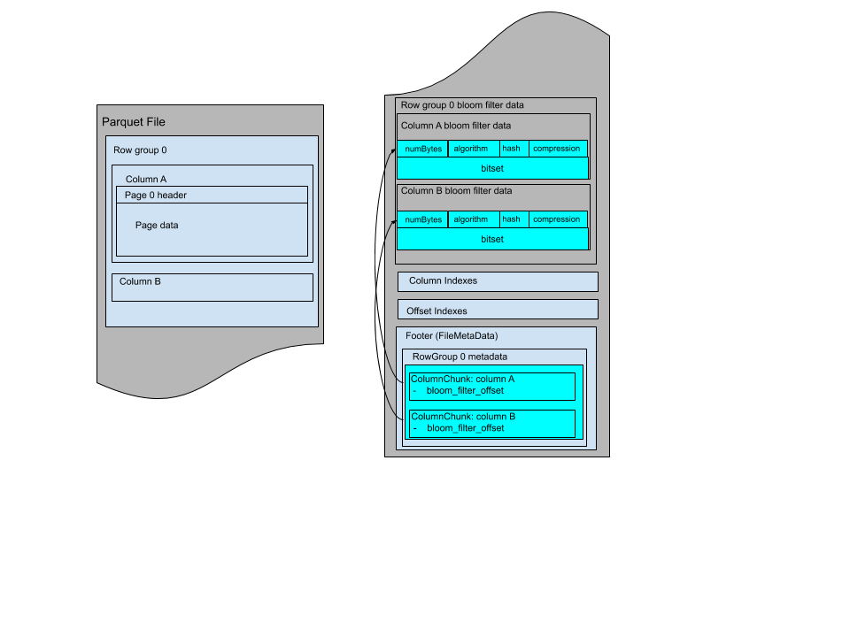

# Parquet
## File Format
In parquet file, we have M row groups, N columns and it's organized as below:
```
4-byte magic number "PAR1"
<Column 1 Chunk 1>
<Column 2 Chunk 1>
...
<Column N Chunk 1>
<Column 1 Chunk 2>
<Column 2 Chunk 2>
...
<Column N Chunk 2>
...
<Column 1 Chunk M>
<Column 2 Chunk M>
...
<Column N Chunk M>
File Metadata
4-byte length in bytes of file metadata (little endian)
4-byte magic number "PAR1"
```
read step:
1. read foot length
2. read metadata footer
3. get offset and then read real data

  

## Configuration
IDEA: big row group + small data page  
big row group: fit big sequential reading
small data page: fit fine grained reading

row group size: recommend 512MiB-1GiB, 1 row fit on 1 HDFS block  
data page size: recommend 8KiB

note: for sequential scan, not expect to read 1 page at a time

## Metadata
file metadata: including schema, datatype, statistics (max, min, null_cnt, distinct_cnt, is_max/min_value_exact), encoding, compression  

page header: including datatype, statistics (max, min, null_cnt, distinct_cnt, is_sorted), encoding, compression

## Bloom Filter
Parquet contains bloom fliter for better accurate search.  
Bloom filter can answer question "definitely no" or "probably yes"  

It is sized and metadata is stored in footer  


## Data Page
compression: the way data is compressed, using general compression method  
encoding: the way data is encoded to binary, a lot of hard-core technique  
encryption: protect sensitive information  
checksum: calculate on CRC32, pages level
column chunk: contains pages written back to back.
error recovery: if file metadata is lost, the file is corrupted. If column metadata is lost, the column chunk is lost. If a page header is corrupted, the remaining pages in that chunk is lost. 

## Page Index
column index and offset index, for speeding up single row select